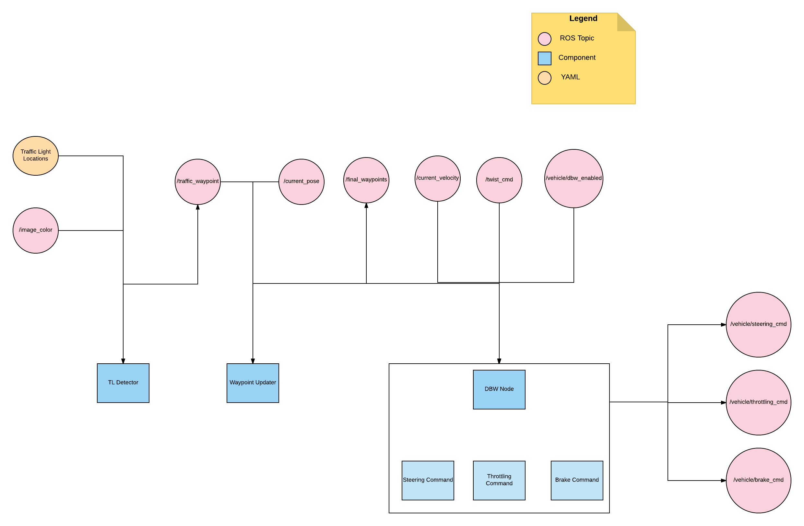

### Team Members

The following are the team members:

Khalid Ashmawy (khalid.ashmawy@gmail.com)
Pavlo Bashmakov (pavel.bashmakov@gmail.com)
Mertin Curban-gazi (mertin23@yahoo.com)
John Ryan (jtryan666@gmail.com)
Brian Chan (499938834@qq.com)

### Architecture

The following diagram shows the architecture of the project:



### Components

The following are the main components of the project:

1. Perception: The perception component can be found under tl_detector and is responsible for classifying if the vehicle has a red traffic light or green traffic light ahead of it.

TL Detector components subscribes to the images captured from the camera mounted on the vehicle (/image_color) and whenever the traffic light is within a certain distance, then it starts passing the image to the classifier for classification.
The classifier classifies the image into either traffic light with red lights, green lights or yellow lights.
The check for the traffic light being within a certain distance is done by checking against the YAML file which contains the positions of the traffic lights.
The state of the traffic light is then published to the following topic: /traffic_waypoint to be used by the other components.

2. Planning: The planning component can be found under waypoint_updater and is responsible for creating a list of waypoints with an associated target velocity based on the perception component.

Waypoint Updater component subscribes to the following topics:

1. /traffic_waypoint: The topic that TL detector component publishes on whenever there is a traffic light.
2. /current_velocity: This topic is used to receive the vehicle velocity.
3. /current_pose: The topic used to receive the vehicle position.

Waypoint Updater detects if there is a red traffic light ahead from the /traffic_waypoint in order to trigger deceleration, otherwise it updates the waypoints ahead on the path with velocities equal to the maximum velocities allowed.
This component finally publishes the result to /final_waypoints.

3. Control: The control component can be found under twist_controller and is responsible for the throttle, brake and steering based on the planning component.

dbw_node is the component responsible for the control of the car. DBW node subscribes to the following topics:

1. /current_velocity: This topic is used to receive the vehicle velocity.
2. /twist_cmd:
3. /vehicle/dbw_enabled: This topic is used to receive if the manual or autonomous mode is enabled.
4. /current_pose: This topic is used to receive the vehicle position.
5. /final_waypoints: This topic is used to receive the waypoints from the planning component (Waypoint Updater).

DBW Node implements a PID controller that takes into account if manual or autonomous mode is enabled. It takes the input from final_waypoints, current_pose, current_velocity and outputs throttling, steering and brake messages to the following topics /vehicle/throttle_cmd, /vehicle/steering_cmd and /vehicle/brake_cmd.

### Classification

We tried multiple approaches for classification and then we finally settled on one based on the results.

The following are the approaches we tried:

1. VGG16 with ImageNet weights and then finetuning

    We started with VGG16 with ImageNet weights and then we added one extra fully connected layer and finetuned it with both simulator images and site images.
    There were advantages and disadvantages to this approach. This approach gave good predictions with accuracy higher than 90%. However inference speed was very slow.


2. SqueezeNet that was trained on Nexar and then finetuning

    We started with SqueezeNet that was trained on Nexar dataset and then we further finetuned it with the simulator images.
    SqueezeNet was much more faster than VGG16 and had very high accuracy rate, over 90% and performed much better the the first approach.
    Being originally trained on Nexar dataset as opposed to ImageNet must have contributed to that given that Nexar dataset are mainly traffic lights as opposed to ImageNet.
    However initially this model was not performing well on simulator images, only on site images. After fine tuning the model, the model started to perform much better on simulator images.

3. Tensorflow APIs and then finetuning

    TODO(Pavlo): Add more info

This is the project repo for the final project of the Udacity Self-Driving Car Nanodegree: Programming a Real Self-Driving Car. For more information about the project, see the project introduction [here](https://classroom.udacity.com/nanodegrees/nd013/parts/6047fe34-d93c-4f50-8336-b70ef10cb4b2/modules/e1a23b06-329a-4684-a717-ad476f0d8dff/lessons/462c933d-9f24-42d3-8bdc-a08a5fc866e4/concepts/5ab4b122-83e6-436d-850f-9f4d26627fd9).

### Installation

* Be sure that your workstation is running Ubuntu 16.04 Xenial Xerus or Ubuntu 14.04 Trusty Tahir. [Ubuntu downloads can be found here](https://www.ubuntu.com/download/desktop).
* If using a Virtual Machine to install Ubuntu, use the following configuration as minimum:
  * 2 CPU
  * 2 GB system memory
  * 25 GB of free hard drive space

  The Udacity provided virtual machine has ROS and Dataspeed DBW already installed, so you can skip the next two steps if you are using this.

* Follow these instructions to install ROS
  * [ROS Kinetic](http://wiki.ros.org/kinetic/Installation/Ubuntu) if you have Ubuntu 16.04.
  * [ROS Indigo](http://wiki.ros.org/indigo/Installation/Ubuntu) if you have Ubuntu 14.04.
* [Dataspeed DBW](https://bitbucket.org/DataspeedInc/dbw_mkz_ros)
  * Use this option to install the SDK on a workstation that already has ROS installed: [One Line SDK Install (binary)](https://bitbucket.org/DataspeedInc/dbw_mkz_ros/src/81e63fcc335d7b64139d7482017d6a97b405e250/ROS_SETUP.md?fileviewer=file-view-default)
* Download the [Udacity Simulator](https://github.com/udacity/CarND-Capstone/releases/tag/v1.2).

### Usage

1. Clone the project repository
```bash
git clone https://github.com/bexcite/CarND-Capstone.git
```

2. Install python dependencies
```bash
cd CarND-Capstone
pip install -r requirements.txt
```
3. Make and run styx
```bash
cd ros
catkin_make
source devel/setup.sh
roslaunch launch/styx.launch
```
4. Run the simulator

### Real world testing
1. Download [training bag](https://drive.google.com/file/d/0B2_h37bMVw3iYkdJTlRSUlJIamM/view?usp=sharing) that was recorded on the Udacity self-driving car (a bag demonstraing the correct predictions in autonomous mode can be found [here](https://drive.google.com/open?id=0B2_h37bMVw3iT0ZEdlF4N01QbHc))
2. Unzip the file
```bash
unzip traffic_light_bag_files.zip
```
3. Play the bag file
```bash
rosbag play -l traffic_light_bag_files/loop_with_traffic_light.bag
```
4. Launch your project in site mode
```bash
cd CarND-Capstone/ros
roslaunch launch/site.launch
```
5. Confirm that traffic light detection works on real life images
